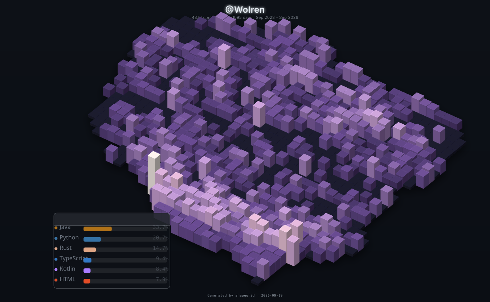
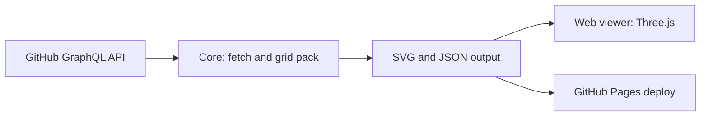
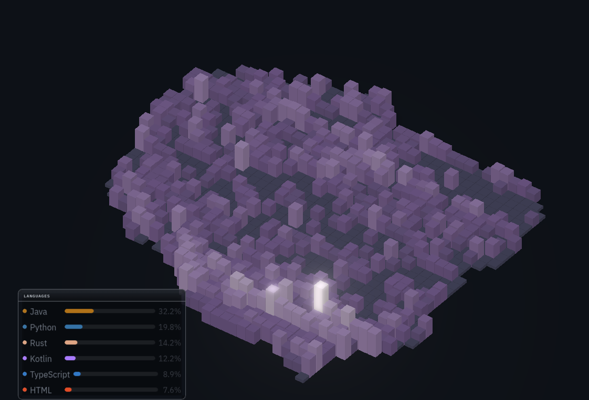

<div align="center">



# Shapegrid

Fit exact-count square or hexagonal grids inside any boundary: 3D isometric activity maps with a GIS dashboard.

[![License][license-badge]][license-url]
[![Last commit][commit-badge]][commits-url]
[![Issues][issues-badge]][issues-url]
[![Code size][size-badge]][repo-url]
[![TypeScript][ts-badge]][ts-url]
[![Three.js][three-badge]][web-url]
[![CI][ci-badge]][ci-url]

</div>

## Problem

GitHub contribution data is always shown on a fixed rectangular grid. Shapegrid fits the same data onto any boundary - a country outline, an SVG shape, a GeoJSON polygon, or one of nine presets - and renders it as a 3D isometric map with exact cell counts and a GIS-style dashboard for exploration.

## How it works



The core CLI fetches contributions through the GitHub GraphQL API, packs an exact-count grid of square or hexagonal cells inside the chosen boundary, and renders an extruded isometric SVG with a legend, coordinate axes, and depth-sorted columns. The web viewer loads the same data in the browser and adds the interactive dashboard.

## Features

- **Nine boundary presets**: shield, circle, star, diamond, heart, rectangle, hexagon, arrow, cross
- **Geographic boundaries**: countries by ISO 3166-1 alpha-2 code, raw polygons, SVG paths, GeoJSON rings, or external GeoJSON/SVG files
- **Exact-count packing**: binary-search cell sizing places precisely N cells of square or hex shape inside any boundary
- **3D isometric SVG**: extruded columns with floor and side faces, depth sorting, configurable yaw and pitch
- **Twelve color palettes**: GitHub, warm, cool, mono, neon, forest, sunset, ocean, fire, pastel, arctic, gold, plus custom palettes
- **Coordinate axes**: longitude and latitude labels with WGS84 cosine correction or Mercator projection for geographic maps
- **WebGL viewer**: interactive Three.js scene with orbit controls, measure tools, real-time palette switching, and ray-traced export
- **GIS dashboard**: 15 draggable overlay widgets (legend, statistics, distribution, timeline, activity, top cells, languages, cell info, scale bar, coordinates, weekday, streak, monthly, geo info, mini map)
- **Day borders**: empty days render as outline-only cells on light backgrounds
- **GitHub Actions CI**: regenerates the grid daily or on config change and deploys to GitHub Pages

## Screenshots

| Web viewer with dashboard widgets |
|---|
|  |

## Quick start

### 1. Install

```bash
pnpm install
pnpm build
```

### 2. Configure

```bash
cp shapegrid.config.yml.example shapegrid.config.yml
```

Key settings:

```yaml
github:
  username: octocat
  token: SHAPEGRID_TOKEN       # env var name (recommended) or literal token

grid:
  type: square                 # square or hex
  count: 365                   # number of cells (match your date range)

boundary:
  type: preset                 # or country | polygon | svgPath | geojson | file
  name: shield
```

### 3. Generate

```bash
pnpm generate --config shapegrid.config.yml
```

Or with CLI flags:

```bash
pnpm generate \
  --user octocat \
  --token ghp_xxx \
  --count 365 \
  --type hex \
  --country PL
```

Output goes to `dist/`: SVG, PNG, and JSON data files.

### 4. View in the browser

```bash
pnpm dev:web
```

Opens the interactive WebGL viewer at `http://localhost:3000`.

## CLI reference

| Flag | Description |
|------|-------------|
| `--config, -c` | Path to config YAML (default: `shapegrid.config.yml`) |
| `--user` | GitHub username (overrides config) |
| `--token` | GitHub token or env var name (overrides config) |
| `--count` | Cell count (overrides config) |
| `--type` | Grid type: `square` or `hex` |
| `--country` | Country code (ISO 3166-1 alpha-2) for the boundary shape |
| `--boundary-file` | Path to a GeoJSON or SVG boundary file |

## Boundary types

| Type | Description | Example |
|------|-------------|---------|
| `preset` | Built-in shapes | `shield, circle, star, diamond, heart, rectangle, hexagon, arrow, cross` |
| `country` | ISO 3166-1 alpha-2 country code | `US, GB, FR, DE, JP, PL, AU` |
| `polygon` | Raw normalized coordinates | `[[0,0], [1,0], [1,1], [0,1]]` |
| `svgPath` | SVG path string (M/L/Z) | `"M 50 0 L 100 25 L 100 75 L 50 100 Z"` |
| `geojson` | GeoJSON polygon ring | Standard GeoJSON coordinates |
| `file` | External GeoJSON or SVG file | `./poland.json` |

For geographic boundaries, Shapegrid auto-detects the coordinate system and applies WGS84 cosine-latitude correction or Mercator projection.

## Web viewer UI

The viewer is a single-page app with eight settings tabs:

| Tab | Contents |
|-----|----------|
| Data | GitHub credentials, date range (last N days, year selector, explicit range) |
| Boundary | Preset shapes, country search, file upload (GeoJSON/SVG) |
| Grid | Cell type, count, gap, coverage, scale mode |
| Camera | Yaw, pitch, zoom for the 3D view |
| Style | Scene palette, height scale, background, boundary outline |
| Effects | Bloom, fog, tone mapping, ray-traced export settings |
| Theme | 12 editor themes and per-widget accent colors |
| Export | Output size, format, auto-crop, orientation, config export/load |

The viewport toolbar provides select, pan, measure distance, measure area, zoom to fit, reset camera, top-down view, export PNG, and layer toggles for boundary, grid, and axes. The header offers config export and load for full round-trip of settings and dashboard layout.

## Tech stack

| Component | Tool | Version |
|-----------|------|---------|
| Language | TypeScript | 7.0 |
| 3D rendering | Three.js | 0.185 |
| GPU path tracing | three-gpu-pathtracer | 0.0.24 |
| Build tool | Vite | 8.2 |
| Package manager | pnpm | 10 |
| CLI rendering | Puppeteer (headless Chrome) | 25.4 |
| Config format | YAML (js-yaml) | 5.2 |
| GIS data | TopoJSON (topojson-client) | 3.1 |
| Widget capture | html2canvas | 1.4.1 |
| Color pickers | vanilla-colorful | 0.7.2 |

## GitHub Actions CI

The `shapegrid.yml` workflow:

1. **Triggers** on pushes to `master` touching the config, workflow, packages, web, or scripts; on a daily schedule; or on manual dispatch with an optional username input
2. **Fetches** contributions via the GitHub GraphQL API
3. **Generates** the SVG grid and JSON data from `shapegrid.config.yml`
4. **Stages** the built viewer and generated assets into `docs/` for GitHub Pages
5. **Renders** a PNG preview with headless Chrome (Puppeteer)
6. **Commits and pushes** the regenerated assets back to the repo

### Setup

1. Create a GitHub PAT with `read:user` scope
2. Add it as a repository secret named `SHAPEGRID_TOKEN`
3. Enable GitHub Pages (Settings > Pages > Branch: `master`, Folder: `/docs`)
4. Push a change to `shapegrid.config.yml`

## Configuration

Full reference at [`shapegrid.config.yml`](./shapegrid.config.yml) in the repo root. Every option is documented inline with examples.

Key sections:

- **github**: username and token
- **boundary**: shape definition
- **grid**: type (square/hex), count, coverage threshold
- **camera**: yaw, pitch for isometric SVG rendering
- **render**: color scale, height scale, gap, background, boundary outline, dimensions
- **dateRange**: last N days or explicit start/end
- **output**: filenames and output directory

## Limitations

- **GitHub API rate limit**: unauthenticated requests are limited to 60/hour. A `SHAPEGRID_TOKEN` with `read:user` scope raises this to 5,000/hour.
- **API query window**: the GitHub GraphQL API caps contribution queries at 365 days. Shapegrid splits longer ranges into 360-day chunks, so very long ranges (5+ years) require multiple API calls.
- **SVG rendering is single-threaded**: large grids (2000+ cells) may take several seconds to generate server-side.
- **WebGL viewer requires a GPU**: the Three.js preview needs WebGL support. Falls back gracefully on software renderers but performance degrades.
- **Country polygon data is approximate**: built-in country boundaries are simplified for rendering speed and may not match official borders.

## Contributing

See [CONTRIBUTING.md](CONTRIBUTING.md).

## License

GNU General Public License v3.0: see [LICENSE](LICENSE).

[license-badge]: https://img.shields.io/github/license/Wolren/Shapegrid
[license-url]: LICENSE
[commit-badge]: https://img.shields.io/github/last-commit/Wolren/Shapegrid
[commits-url]: https://github.com/Wolren/Shapegrid/commits
[issues-badge]: https://img.shields.io/github/issues/Wolren/Shapegrid
[issues-url]: https://github.com/Wolren/Shapegrid/issues
[size-badge]: https://img.shields.io/github/languages/code-size/Wolren/Shapegrid
[repo-url]: https://github.com/Wolren/Shapegrid
[ts-badge]: https://img.shields.io/badge/TypeScript-7.0-blue?logo=typescript
[ts-url]: tsconfig.base.json
[three-badge]: https://img.shields.io/badge/Three.js-0.185-lightgrey?logo=three.js
[web-url]: web/package.json
[ci-badge]: https://github.com/Wolren/Shapegrid/actions/workflows/shapegrid.yml/badge.svg
[ci-url]: https://github.com/Wolren/Shapegrid/actions/workflows/shapegrid.yml
